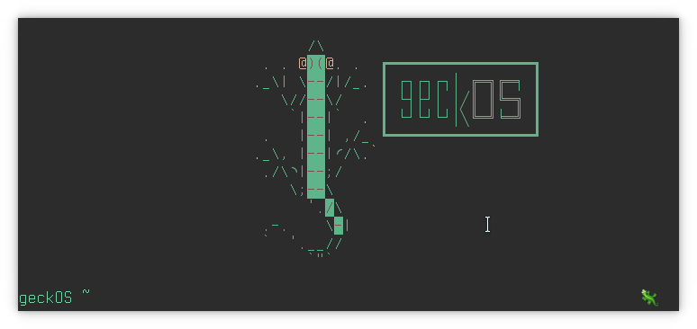
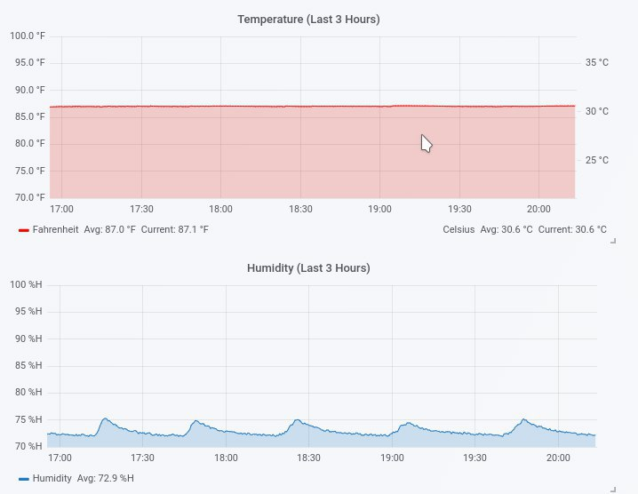

Raspberry Pi controlled gecko terrarium with automated humidity control, temperature control, sensor data aggregation and analytics, and remote viewing.

 

 <a href="https://youtu.be/haW_5Sqxg0g" rel="nofollow">Video Tour</a> 

 

The primary sensors used were the BME280 and CCS811. The CCS811 in my case was unreliable and required the Pi to be unpowered and repowered frequently when the sensor experienced an error for it to resume taking accurate readings.

This project is predominantly shell scripts which were executed on a cron schedule. The terrarium environmental control scripts would be executed once per minute, and would take a humidity and temperature reading from the BME280. For this project I had reverse engineered Tuya Smart Outlets to work via remote HTTP payloads to circumvent the requirement for a smartphone app to control wall-outlet electrical connectivity. Through these outlet devices I could control the terrarium heatpads, lamps, and humidity system (which is comprised of ultra-sonic water mist-makers and a fan to push the mist--please see the above video for a better look).

The Pi was also running a Grafana server with InfluxDB which is where temperature and humidity readings were pushed for timeseries analysis. This data pushing is just done with an HTTP payload to localhost via the Influx HTTP API.

